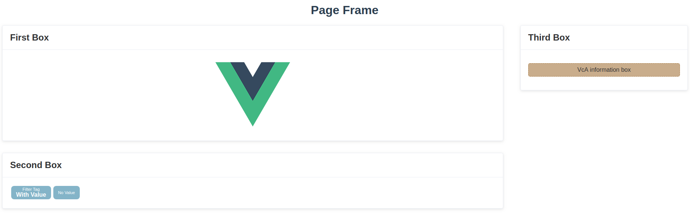
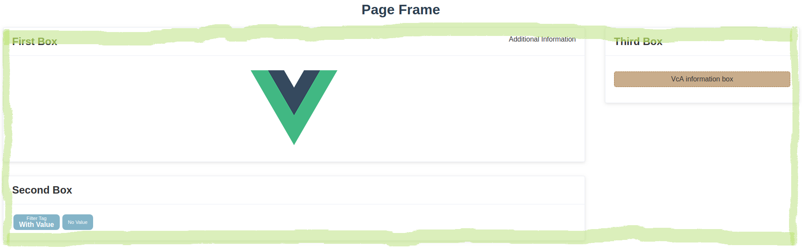
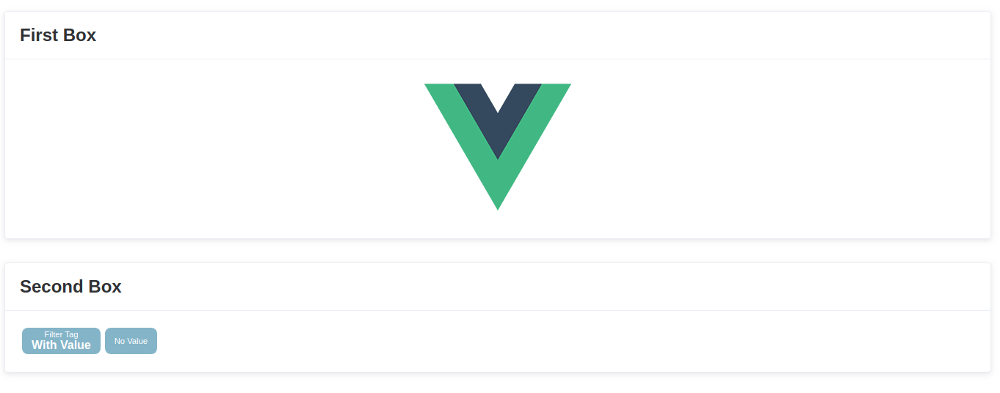
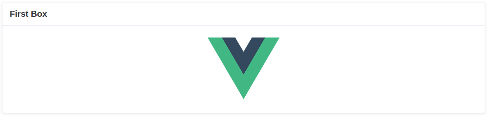
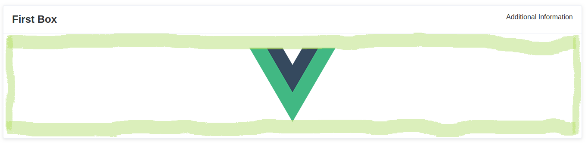
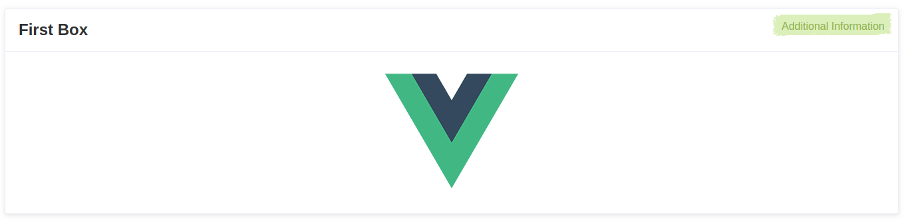
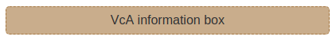
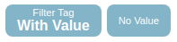
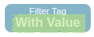

# vca-widget-base

[](https://www.npmjs.com/package/vca-widget-base) [](https://vuejs.org/)

> Implements different visualizations for a user.

## Widgets
This package implements the following widgets. These are mostly widgets supporting the consistent user interface of Viva 
con Aguas Pool².

### VcA Frame
The frame describes the base of a Pool² page. Content is organized in [VcA Boxes](#vca-box) and these boxes are part of 
the [VcA Columns](#vca-column) which are positioned by the VcA Frame. Additionally, it is possible to add a title.



You can use it that way (the `:` as prefix of an attribute is a vue.js syntax to parse the value as numeric or boolean):
```xml
<VcAFrame title="Page Frame" :hasContainer="true">
    ...
</VcAFrame>
```

| Parameter | Type | Optional | Default | Description |
|-----------|------|----------|---------|-------------|
| `title` | String | optional | *No default value* | You can pass an optional title. It will be used as a `<h1>` tag at the top-center position of the page. |
| `hasContainer` | Boolean | optional | `false` | Sometimes it is required to wrap your [VcA columns](#vca-column) in additional HTML tags. For example, if you have an HTML `form` comprising elements on multiple columns. In that case you have to pass `true` as value of this parameter. |

| Slot | Position | Description |
|------|----------|-------------|
| *default* |  | Contains all [columns](#vca-column) of the page. |

### VcA Column
Columns organize the [VcA boxes](#vca-box) in a vertical order. 



You can use it that way:
```xml
<VcAColumn size="90%">
    ...
</VcAColumn>
```

| Parameter | Type | Optional | Default | Description |
|-----------|------|----------|---------|-------------|
| `size` | String | optional | `30%` | If you want to change the default width, you can pass a new width using the `size` paramater. Values consist of a number and an unit. |

| Slot | Position | Description |
|------|----------|-------------|
| *default* | *see example image* | Contains all [boxes](#vca-box) of the column. |

### VcA Box
Boxes contain the main content of a Pool² page. They can be used for any kind of content and help you to cluster your
information and functions. Please try to develop a small concept how you want to use these boxes, since the usage of boxes 
will influence the usability of your microservice and thus, of the whole Pool².



You can use it that way (all attribute values are random examples):
```xml
<VcABox :first="true" title="Headline" :expand="true" className="vca-blue-background vca-more-shadow">
    <template slot="header">
        ...
    </template>
    ...
</VcABox>
```

| Parameter | Type | Optional | Default | Description |
|-----------|------|----------|---------|-------------|
| `first` | Boolean | optional | `false` | Indicates, if the box is the first one in the column. `false` means that their will be some space added on top of the box as a margin to other boxes on top of this. |
| `title` | String | optional | *No default value* | You can pass an optional title. It will be used as a `<h2>` tag at the top-left corner of the box. |
| `expand` | Boolean | optional | `false` | Indicates, size should expand to all unused space of the column. |
| `className` | Boolean | optional | *No default value* | You can pass additional class names to apply your own CSS styles to the box. |

| Slot | Position | Description |
|------|----------|-------------|
| *default* |  | Contains the main content |
| header |  | Could be used for small additional information (e.g. tags) or important functions |


### VcA Info Box
This box will be used to raise the users attention and inform the user about important facts.



You can use it that way:
```xml
<VcAInfoBox>
    ...
</VcAInfoBox>
```
*There are no parameters for this widget*

| Slot | Position | Description |
|------|----------|-------------|
| *default* | *see example image* | Contains the information to show. |

### VcA Filter Tag
Tags can be used to display key-value structured information. For example, it is used in Drops to show the selected search
criteria of the user search (user model attribute and the search key).



You can use it that way (all attribute values are random examples):
```xml
<VcAFilterTag field="Filter Tag">
    With Value
</VcAFilterTag>
```
As an alternative you can also pass the `value` as attribute
```xml
<VcAFilterTag field="Filter Tag" value="With Value" />
```

| Parameter | Type | Optional | Default | Description |
|-----------|------|----------|---------|-------------|
| `field` | String | required | - | Will be used as the key (smaller font in the first line) |
| `value` | String | optional | *No default value* | Will be used as the value (bigger font in the second line) |

| Slot | Position | Description |
|------|----------|-------------|
| *default* |  | Could be used to pass the value. |

## Installation

```bash
npm install --save vca-widget-base
```

## Quick Start

### Vue.js

```js
import Vue from 'vue'
import { VcAFrame, VcAColumn, VcABox, VcAInfoBox, VcAFilterTag } from 'vca-widget-base'
import 'vca-widget-base/dist/vca-widget-base.css'

export default {
  name: 'App',
  components: { VcAFrame, VcAColumn, VcABox, VcAInfoBox, VcAFilterTag }
}

```

Inside your template:
```xml
<template>
  <div id="app">
    <VcAFrame title="VcA Page">
        <VcAColumn size="90%">
            <VcABox title="First Box" :first="true">
              <template slot="header">
                Additional Information
              </template>
                Example content
            </VcABox>
            <VcABox title="Second Box">
                <div style="display:flex;flex-direction:row">
                    <VcAFilterTag field="Filter Tag" value="With Value" />
                    <VcAFilterTag field="No Value" />
                </div>
            </VcABox>
        </VcAColumn>
        <VcAColumn>
            <VcABox title="Third Box" :first="true">Another content</VcABox>
            <VcABox title="Fourth Box">
                <VcAInfoBox>VcA Info Box</VcAInfoBox>
            </VcABox>
        </VcAColumn>
    </VcAFrame>
  </div>
</template>
```

### Browser

You can also use the widget without Vue.js. 

```html
<!-- Include after Vue -->
<!-- Local files -->
<link rel="stylesheet" href="vca-widget-base/dist/vca-widget-base.css"></link>
<script src="vca-widget-base/dist/vca-widget-base.js"></script>

<!-- From CDN -->
<link rel="stylesheet" href="https://unpkg.com/vca-widget-base/dist/vca-widget-base.css"></link>
<script src="https://unpkg.com/vca-widget-base"></script>
```

## Development

### Launch visual tests

```bash
npm run serve
```

### Build

Bundle the js and css of to the `dist` folder:

```bash
npm run lib
```


## Publishing

The `prepublish` hook will ensure dist files are created before publishing. This
way you don't need to commit them in your repository.

```bash
# Bump the version first
# It'll also commit it and create a tag
npm version
# Push the bumped package and tags
git push --follow-tags
# Ship it 🚀
npm publish
```

## License
